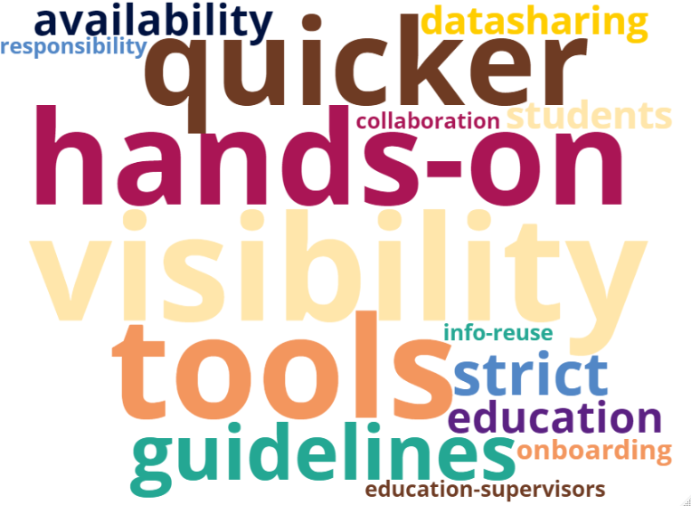
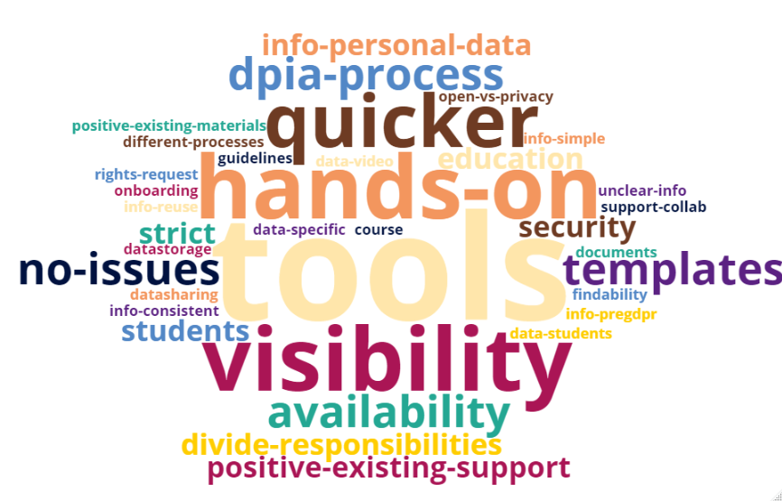
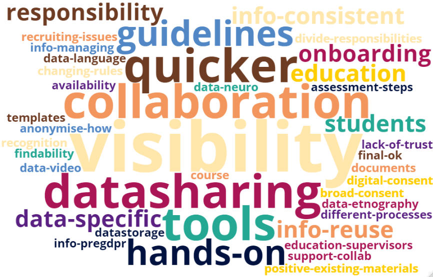
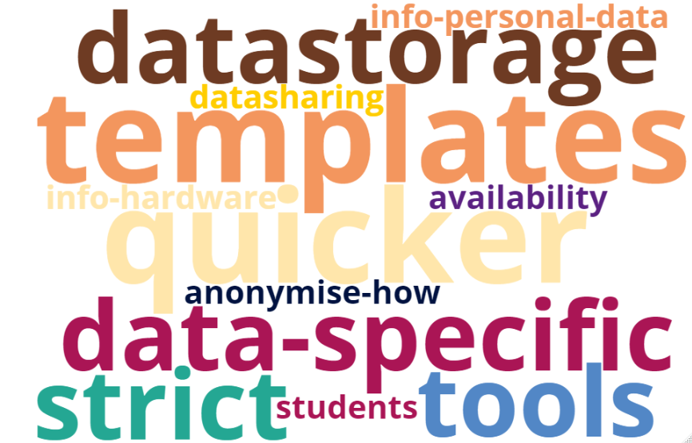
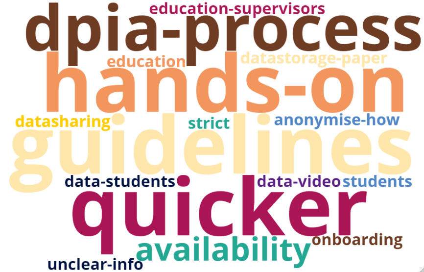
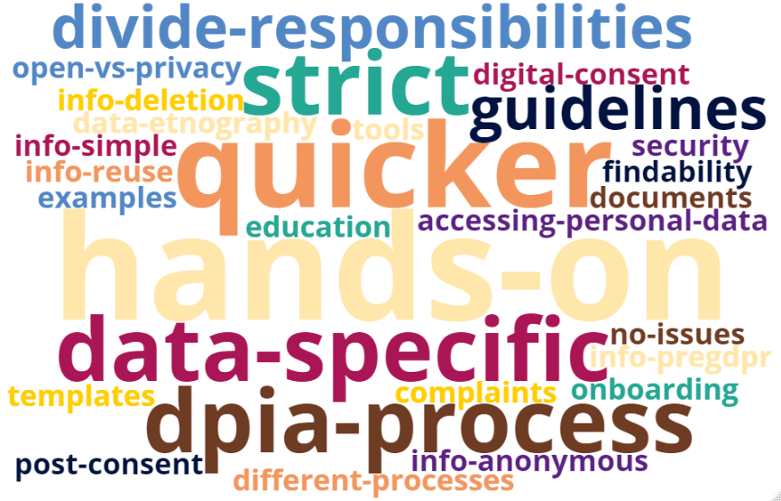
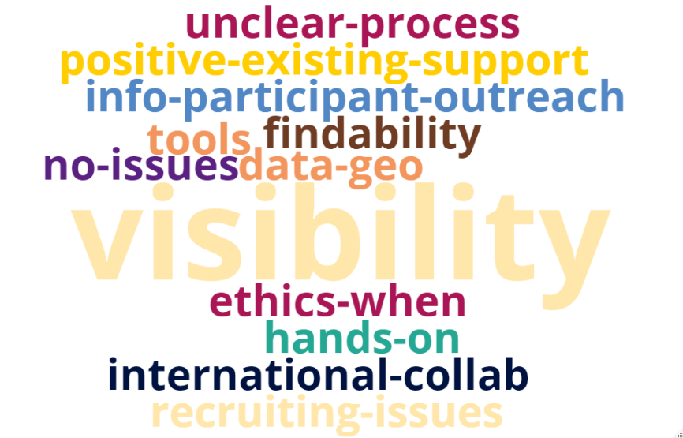

```{r setup, include=FALSE}
knitr::opts_chunk$set(echo = FALSE, 
                      warning = FALSE, 
                      message = FALSE,
                      fig.align = "center")
```

```{r sourcescript, include=FALSE, cache=FALSE}
# Most of the code used for loading the data and plotting the figures in this
# report can be found in the "plot-data.R" file that is loaded in this chunk.
knitr::read_chunk('plot-data.R')
source("plot-data.R", local = knitr::knit_global())
```

# Introduction {#introduction}
Scientific research often includes some form of personal data. However, 
researchers may be unaware of what personal data are or whether they are being 
collected. With the implementation of the General Data Protection Regulation 
(GDPR) in 2018, stricter legal requirements apply to handling personal data and 
its sharing and publication. In our own experience, the number and complexity of 
questions on handling personal data in scientific research at Utrecht University 
(UU) is increasing.  

Our goal at [Research Data Management Support](https://uu.nl/rdm){target="_blank"} 
(RDM Support) is to assist researchers with any issues 
surrounding the management of their research data, including research data that 
contain personal data. To understand how we can best help researchers with their 
privacy-related questions and needs, we wanted to investigate:

1. To what extent are UU researchers aware of privacy legislation and practices?
2. What data privacy issues do UU researchers typically run into?
3. What support do UU researchers need to handle personal data?

To answer these questions, we set up an online survey and planned one-on-one 
meetings with a selection of UU researchers. This report describes our methods 
and full results of both the online survey and the one-on-one meetings. For a
full summary of the results and recommendations on how to move forward, please
refer to the [Recommendations report](https://utrechtuniversity.github.io/dataprivacysurvey/docs/data-privacy-survey-recommendations.html){target="_blank"}.

This survey was part of a larger project, the 
[Data Privacy Project](https://utrechtuniversity.github.io/dataprivacyproject/){target="_blank"}^[The 
Data Privacy Project was funded by Utrecht University’s Research IT program and 
a Digital Competence Center grant from the Dutch Organization for Scientific 
Research (NWO).], a data support effort led by RDM Support at UU that aims to 
provide actionable and FAIR (Findable, Accessible, Interoperable, Reusable) 
information and tools for researchers to handle personal data in their research. 

# Methods {#methods}
```{r dependencies}
```

```{r readdata}
```

```{r labelsfsw}
```

```{r facultydatasets}
```

```{r uustyle}
```

## Survey questions {#survey-questions}
The [Data Privacy Survey](#data-and-material-availability) was created by the project 
coordinators (DH, NM) with input from a wide variety of experts, consisting of 
privacy experts, data managers, data consultants, and IT staff (e.g., information 
security,  research engineering). The survey consisted of 19-23 questions 
(the exact number differing depending on given answers), which were separated 
into 5 sections:

1. **About you and your research**: 5 questions about the faculty, department, 
position, and type of (personal) data the researcher works with.
2. **Measures and documents**: 4-6 questions about researchers' familiarity and
use of privacy-related measures (e.g., processing register, Data Protection Impact
Assessment, encryption, pseudonymisation, etc.), data storage, and informed 
consent forms.
3. **Data sharing, archiving and publication**: 3-4 questions about researchers' 
data sharing and publishing practices.
4. **Finding support**: 3-4 questions about the awareness of several data support
channels.
5. **Improving our services**: 4 questions about researchers' challenges, needs, 
and suggestions to improve UU's data privacy support.

The estimated 10 minute duration of the survey in advance proved to be 
relatively accurate: respondents spent a median of 
`r round(median(dppsurvey$Duration/60), 1)` minutes on the survey (although 
there was a very large variation; range: 
`r round(min(dppsurvey$Duration)/60, 1)` minutes - 
`r round(max(dppsurvey$Duration)/3600/24,1)` days).

## Procedure online survey {#procedure-online-survey}
The survey was created in Qualtrics and distributed from March 21st, 2022 
onwards via several communication channels to reach as many UU researchers as 
possible:

- An [email](https://utrechtuniversity.github.io/dataprivacyproject/20220321-data-privacy-survey.html){target="_blank"}
was sent to all academic staff at UU through 
central communication channels. The reasoning was that this would be the most
effective way to reach as many UU researchers as possible - taking for granted
that we would likely miss a small part of non-academic personnel also involved
in research in some way.
- A mention in several Faculty newsletters.
- Social media messages (e.g., on [Twitter](https://twitter.com/RDMsupportUU/status/1517390979707412481){target="_blank"}.
- A [news item](https://intranet.uu.nl/en/news/news-items/survey-better-support-for-handling-privacy-sensitive-data-in-research){target="_blank"}
on the UU intranet.
- Via data support colleagues, who were asked to point researchers they were
in contact with to the survey.

Researchers could decide voluntarily whether they wanted to participate in the
survey. All results reported here come from researchers who provided their active 
consent, worked at Utrecht University and indicated to work with some type of 
research data.

## Online survey respondents {#online-survey-respondents .tabset}
### UU-wide {.active}
The survey was filled out by `r dim(dppsurvey)[1]` UU researchers. As can be 
seen in the figure below, we received responses from each UU faculty, but the 
distribution was not equal: the faculties of Science and Social and Behavioural 
Sciences (FSBS) were overrepresented, whereas the responses of the Faculty of 
Geosciences and the Faculty of Medicine were rather low. This can be explained 
by the mere size of the faculties (e.g., the faculty of Science is UU's largest 
faculty), but also by the types of research performed there. For example, 
research performed at the faculty of Geosciences is largely involved with 
natural scientific data, rather than data from or relating to humans. The 
Faculty of Medicine, then, is located at the University Medical Center Utrecht 
(UMCU) and is not of primary interest for the current survey, which was sent to 
UU researchers only. A small selection of respondents indicated to work at 
another part of the organisation, i.e., mainly University College Utrecht and 
the University Corporate Office.

Most of the survey respondents were relatively early 
career researchers (PhDs, junior researchers and postdoctoral researchers). 
We suspect that this is because 1) there simply are more employees in these positions
than there are in the others, and 2) early-career researchers may experience a 
greater need for support with respect to handling personal data.

```{r facultyplot}
```

Note that for the faculty-specific figures, the amount of respondents from the 
entire faculty were not always equal to the sum of respondents per department. This
was caused by the fact that the Department question was not mandatory, and 
allowed multiple responses. So some respondents could be part of several 
departments, and others are not displayed in the Department plot, because they
did not leave an answer to that question.

### Science
There were `r dim(dppsurvey_science)[1]` respondents from the Science faculty 
in the online survey. It took them a median of 
`r round(median(dppsurvey_science$Duration/60), 1)` minutes to complete it
(ranging from `r round(min(dppsurvey_science$Duration)/60, 1)` minutes to 
`r round(max(dppsurvey_science$Duration)/3600/24,1)` days). In the graph below,
the representation of each department within the Science faculty is visualised. 

```{r sciencedepartments}
plotdepartments(dppsurvey_science, "Science", 
                 title = "Department representation Science", 
                 caption = "Departments of online survey respondents from the Science faculty")
```

### FSBS
There were `r dim(dppsurvey_fsw)[1]` respondents from the Faculty of Social and
Behavioural Sciences (FSBS) in the online survey. It took them a median of 
`r round(median(dppsurvey_fsw$Duration/60), 1)` minutes to complete it (ranging 
from `r round(min(dppsurvey_fsw$Duration)/60, 1)` minutes to 
`r round(max(dppsurvey_fsw$Duration)/3600/24,1)` days). In the graph below,
the representation of each department within FSBS is visualised. 

```{r fswdepartments}
plotdepartments(dppsurvey_fsw, "FSW", 
                 title = "Department representation FSBS", 
                 caption = "Departments of online survey respondents from the FSBS")
```

### Humanities
There were `r dim(dppsurvey_hum)[1]` respondents from the Faculty of Humanities
in the online survey. It took them a median of 
`r round(median(dppsurvey_hum$Duration/60), 1)` minutes to complete it (ranging 
from `r round(min(dppsurvey_hum$Duration)/60, 1)` minutes to 
`r round(max(dppsurvey_hum$Duration)/3600/24,1)` days). In the graph below,
the representation of each department within the Faculty of Humanities is visualised. 

```{r humdepartments}
plotdepartments(dppsurvey_hum, "Humanities", 
                 title = "Department representation Humanities", 
                 caption = "Departments of online survey respondents from the Faculty of Humanities")
```

### Veterinary Medicine
There were `r dim(dppsurvey_vet)[1]` respondents from the Faculty of Veterinary
Medicine in the online survey. It took them a median of 
`r round(median(dppsurvey_vet$Duration/60), 1)` minutes to complete it (ranging 
from `r round(min(dppsurvey_vet$Duration)/60, 1)` minutes to 
`r round(max(dppsurvey_vet$Duration)/3600/24,1)` days). In the graph below,
the representation of each department within the Faculty of Veterinary Medicine 
is visualised. 

```{r vetdepartments}
plotdepartments(dppsurvey_vet, "DGK", 
                 title = "Department representation Veterinary Medicine", 
                 caption = "Departments of online survey respondents from the Faculty of Medicine")
```


### LEG
There were `r dim(dppsurvey_leg)[1]` respondents from the Faculty of Law, 
Economics, and Governance (LEG) in the online survey. It took them a median of 
`r round(median(dppsurvey_leg$Duration/60), 1)` minutes to complete it (ranging 
from `r round(min(dppsurvey_leg$Duration)/60, 1)` minutes to 
`r round(max(dppsurvey_leg$Duration)/3600/24,1)` days). In the graph below,
the representation of each department within the Faculty of Law, Economics, and 
Governance (LEG) is visualised. 

```{r legdepartments}
plotdepartments(dppsurvey_leg, "REBO", 
                 title = "Department representation LEG", 
                 caption = "Departments of online survey respondents from the Faculty of Law, Economics and Governance")
```

### Geo
There were `r dim(dppsurvey_geo)[1]` respondents from the Faculty of Geosciences
in the online survey. It took them a median of 
`r round(median(dppsurvey_geo$Duration/60), 1)` minutes to complete it (ranging 
from `r round(min(dppsurvey_geo$Duration)/60, 1)` minutes to 
`r round(max(dppsurvey_geo$Duration)/3600/24,1)` days). In the graph below,
the representation of each department within the Faculty of Geosciences is visualised. 

```{r geodepartments}
plotdepartments(dppsurvey_geo, "Geo", 
                 title = "Department representation Geosciences", 
                 caption = "Departments of online survey respondents from the Faculty of Geosciences")
```

### {-}

## One-on-one meetings {#one-on-one-meetings .tabset}
Besides the online survey, we organised one-on-one meetings with researchers, to 
hear about their personal experiences, challenges and needs concerning the handling 
of personal data in their research. Survey respondents could voluntarily leave 
their email address at the end of the survey to be contacted by us. These 
meetings were semi-structured and revolved around the following questions:

- What made you leave your email address in the Data Privacy Survey? Related:
What are your general experiences in handling personal data in research?
- Which difficulties do you run into when handling personal data?
- What support would you need to help you handle personal data in your research?
- Do you have a concrete need for support at the moment?

All of the one-on-one meetings were conducted online and took approximately 30
minutes. During the meetings, one of the project coordinators (DH) was always 
present, together with either the other project coordinator (NM) or the 
relevant faculty privacy officer. Before the privacy officer was invited to 
the meeting, the researcher's consent to do so was always obtained first.

```{r read-opentext}
```

```{r opentext-faculties}
```

### UU-wide {.active}
From the survey respondents, `r sum(dppsurvey$Email == "Yes", na.rm=TRUE)`
researchers left their email address to be contacted. Of those, 28 researchers 
indicated that they were willing to meet with us. Below, the division over 
faculties can be seen for all interviewees. Notably, the distribution seemed to
mirror the faculty distribution in the entire survey relatively well.

```{r emailaddressplot}
```

### Science

From the survey respondents, `r sum(dppsurvey_science$Email == "Yes", na.rm=TRUE)` 
researchers from the Faculty of Science left their email address to be contacted. 
Of those, `r dim(interviews_science)[1]` online meetings have been conducted, 
each with the project coordinators. Below, the division over 
positions can be seen for all interviewees from the Faculty of Science.

```{r positionsmeetings-science}
positionsmeetings(interviews_science,
                  title = "Positions one-on-one meetings Science",
                  caption = "Positions of Science researchers in one-on-one meetings")
```

### FSBS

From the survey respondents, `r sum(dppsurvey_fsw$Email == "Yes", na.rm=TRUE)` 
researchers from the Faculty of Social and Behavioural Sciences (FSBS) left their 
email address to be contacted. Of those, `r dim(interviews_fsw)[1]` online 
meetings have been conducted, most of them with the faculty privacy officer present. 
Below, the division over positions can be seen for all interviewees from the 
Faculty of Social and Behavioural Sciences (FSBS).

```{r positionsmeetings-fsw}
positionsmeetings(interviews_fsw,
                  title = "Positions one-on-one meetings FSBS",
                  caption = "Positions of researchers of the Faculty of Social and Behavioural Sciences in one-on-one meetings")
```

### Humanities

From the survey respondents, `r sum(dppsurvey_hum$Email == "Yes", na.rm=TRUE)` 
researchers from the Faculty of Humanities left their email address to be contacted. 
Of those, `r dim(interviews_hum)[1]` online meetings have been 
conducted, all of them with one of the faculty privacy officers present. Below, 
the division over positions can be seen for all interviewees from the Faculty of 
Humanities.

```{r positionsmeetings-hum}
positionsmeetings(interviews_hum,
                  title = "Positions one-on-one meetings Humanities",
                  caption = "Positions of Humanities researchers in one-on-one meetings")
```

### Veterinary Medicine

From the survey respondents, `r sum(dppsurvey_vet$Email == "Yes", na.rm=TRUE)` 
researchers from the faculty of Veterinary Medicine left their email address to 
be contacted. Of those, `r dim(interviews_vet)[1]` online meetings have been 
conducted, most of them with a one of the faculty privacy officers present. 
Below, the division over positions can be seen for all interviewees from the 
faculty of Veterinary Medicine.

```{r positionsmeetings-vet}
positionsmeetings(interviews_vet,
                  title = "Positions one-on-one meetings Veterinary Medicine",
                  caption = "Positions of researchers from the Faculty of Veterinary Medicine in one-on-one meetings")
```


### LEG

From the survey respondents, `r sum(dppsurvey_leg$Email == "Yes", na.rm=TRUE)` 
researchers from the faculty of Law, Economics, and Governance (LEG) left their 
email address to be contacted. Of those, `r dim(interviews_leg)[1]` online 
meetings have been conducted, both of them with one of the privacy officers 
present. Below, the division over positions can be seen for all interviewees 
from the faculty of Law, Economics, and Governance (LEG).

```{r positionsmeetings-leg}
positionsmeetings(interviews_leg,
                  title = "Positions one-on-one meetings LEG",
                  caption = "Positions of researchers from the Faculty of Law, Economics, and Governance in one-on-one meetings")
```

### Geo

From the survey respondents, `r sum(dppsurvey_geo$Email == "Yes", na.rm=TRUE)` 
PhD/junior/postdoctoral researcher from the Faculty of Geosciences left their 
email address to be contacted and agreed to indeed meet online.

```{r positionsmeetings-geo}
# Greyed out because just 1 researcher
#positionsmeetings(interviews_geo,
#                  title = "Positions one-on-one meetings Geosciences",
#                  caption = "Positions of Geosciences researchers in one-on-one meetings")
```

### {-}

## Analysis {#analysis}
From the raw Qualtrics output, we first cleaned and split the data into different
data files (cleaned and closed survey responses, open text responses, email
addresses, see the 
[pseudonymise-data.R](https://github.com/UtrechtUniversity/dataprivacysurvey/blob/main/src/pseudonymise-data.R){target="_blank"}
script for details). Both the open text 
responses and the notes made during the one-on-one meetings were separately and 
manually coded to enable the extraction of action points (see the file [codes-open-text-responses-meetings.csv](https://github.com/UtrechtUniversity/dataprivacysurvey/blob/main/documentation/codes-open-text-responses-meetings.csv){target="_blank"}
for the codes used).

Below we report on the descriptive statistics or summaries from the 
survey questions and notes made during the one-on-one meetings. As we did not 
formulate hypotheses, no statistical analyses were performed. 

## Data and material availability {#data-and-material-availability}
All survey-related documentation can be found in the 
[dedicated GitHub repository](https://github.com/UtrechtUniversity/dataprivacysurvey){target="_blank"}. 

### Documentation {#documentation-availability}
- A [general description](https://utrechtuniversity.github.io/dataprivacysurvey){target="_blank"} 
and links to the relevant written reports.
- The 
[full survey](https://utrechtuniversity.github.io/dataprivacysurvey/documentation/survey-questions-qualtrics.pdf){target="_blank"}.
- The survey's [privacy statement](https://utrechtuniversity.github.io/dataprivacysurvey/documentation/survey-privacy-statement.pdf){target="_blank"}.
- The survey's [Data Management Plan](https://utrechtuniversity.github.io/dataprivacysurvey/documentation/survey-data-management-plan.pdf){target="_blank"}.
- The [codes used](https://github.com/UtrechtUniversity/dataprivacysurvey/blob/main/documentation/codes-open-text-responses-meetings.csv){target="_blank"}
to score open text responses and meeting notes.
- [Codebook](https://github.com/UtrechtUniversity/dataprivacysurvey/blob/main/documentation/survey-codebook.csv){target="_blank"}
of the survey in .csv format.

### Code {#code-availability}
The repository contains all [scripts and documents](https://github.com/UtrechtUniversity/dataprivacysurvey/tree/main/src){target="_blank"}
used to clean the data and write the reports.

### Data {#data-availability}
As the dataset contains personal information (demographic information, open text 
responses, email addresses, etc.), and no consent was obtained to share those 
details, we are unable to share them in this repository. We did however create a
[synthetic (fake) dataset](https://github.com/UtrechtUniversity/dataprivacysurvey/tree/main/data/processed/Data_Privacy_Survey_fakedataset_20220929.csv){target="_blank"}
with 100 rows using Qualtrics's "Generate responses" functionality. This dataset 
can be used to regenerate most of the current report, but will not create any 
realistic results. 

To reproduce this report:

1. Clone [the repository](https://github.com/UtrechtUniversity/dataprivacysurvey){target="_blank"} from GitHub.
2. Open [pseudonymise-data.R](https://github.com/UtrechtUniversity/dataprivacysurvey/blob/main/src/pseudonymise-data.R){target="_blank"}, 
change the path to the ("raw") dataset and run the script. This will create a 
clean version of the dataset, stored in either the data/processed or data/pseud folder.
3. Open the file [data-privacy-survey-report.Rmd](https://github.com/UtrechtUniversity/dataprivacysurvey/blob/main/src/data-privacy-survey-report.Rmd){target="_blank"}
and knit the document. Note that the final part of the report cannot be 
reproduced, because there is no synthetic data available for the open text 
responses and one-on-one meeting notes.

# Results {#results}
## Types of research data {#types-of-research-data .tabset}
### UU-wide {.active}

To investigate the types of research that were represented in the sample, we 
asked with which types of data, and specifically which types of *personal* data, 
researchers worked. Most researchers indicated to use tabular, textual, 
code and audio data as their primary research data format. 
In terms of *personal* data types, contact information, demographic information 
and direct identifiers were most common. This can be either because these are 
the types of personal data that are indeed most common, but possibly also because 
researchers mostly recognised these types of data as being personal data.

```{r datatypesuu, results = "asis"}
# Source: https://stackoverflow.com/questions/17717323/align-two-data-frames-next-to-each-other-with-knitr
tables_uu <- datatypes(dppsurvey)

if(knitr::is_html_output()){
  htmltables <- datatypes_html(tables_uu)
  cat(c('<table><tr valign="top"><td>', 
        htmltables[[1]], 
        '</td><td>', 
        htmltables[[2]], 
        '</td><tr></table>'),
      sep = '')
}

if(knitr::is_latex_output()){
  datatypes_latex(tables_uu)
}
```
<br>
    
When comparing faculties, it seemed that most personal data were processed in the
faculty of Social and Behavioural Sciences (FSBS), although the faculties of 
Science and Veterinary Medicine also seemed to process quite some personal data.
In the tabs, we look further into the types of (personal) data processed within
each faculty.

```{r personaldataplot, fig_height = 10}
```

### Science

As with the university-wide data, researchers from the Science faculty indicated
that they also most often used tabular data, textual data and code/theoretical 
models in their research. The same goes for the types of *personal* data: the
same top-3 types were used here as in the entire university (demographic 
information, contact information, direct identifiers). 

```{r datatypesscience, results = "asis"}
tables_science <- datatypes(dppsurvey_science)

if(knitr::is_html_output()){
  htmltables_science <- datatypes_html(tables_science)
  cat(c('<table><tr valign="top"><td>', 
        htmltables_science[[1]], 
        '</td><td>', 
        htmltables_science[[2]], 
        '</td><tr></table>'),
      sep = '')
}

if(knitr::is_latex_output()){
  datatypes_latex(tables_science)
}
```
<br>
  
As a large part of the researchers from the Science faculty indicated not to use
*any* personal data whatsoever in their research, it may be useful to 
investigate whether this differed per department. In the figure below,
the division of personal data types per Science department is plotted. As can be
expected, the departments of Biology, Physics and Mathematics did not seem to 
process much personal data, whereas in the Information and Computing Sciences
and Pharmaceutical Sciences departments, the most personal data were processed. 
This makes sense considering the types of research performed in these departments.

```{r datatypesdeptsscience, fig.height=8}
datatypesdepartments(dppsurvey_science, "Science",
                     caption = "Personal data types used in each department of the Science faculty")
```

### FSBS

As with the university-wide data, researchers from the Faculty of Social and
Behavioural Sciences (FSBS) indicated that they also most often used tabular data, 
textual data and code/theoretical models in their research. The same goes for 
the types of *personal* data: demographic and contact information were used most 
often. Interestingly, sensitive demographic information was used much more often
relative to the UU-wide responses.

```{r datatypesfsw, results = "asis"}
tables_fsw <- datatypes(dppsurvey_fsw)

if(knitr::is_html_output()){
  htmltables_fsw <- datatypes_html(tables_fsw)
  cat(c('<table><tr valign="top"><td>', 
        htmltables_fsw[[1]], 
        '</td><td>', 
        htmltables_fsw[[2]], 
        '</td><tr></table>'),
      sep = '')
}

if(knitr::is_latex_output()){
  datatypes_latex(tables_fsw)
}

```
<br>
  
When comparing the types of personal data across departments of the faculty, the
departments of Sociology and Cultural Anthropology seemed to process the least
amount of personal data - although these departments may also simply be 
underrepresented in the survey sample. Most other departments processed quite some
personal data, as can be expected from a faculty of which the research focuses
almost exclusively on humans. 

```{r datatypesdeptsfsw, fig.height=8}
datatypesdepartments(dppsurvey_fsw, "FSW",
                     caption = "Personal data types used in each department of the Faculty of Social and Behavioural Sciences")
```

### Humanities
As with the university-wide data, researchers from the Faculty of Humanities 
indicated that they also most frequently used tabular data, textual data and 
audio data in their research. The same goes for the types of *personal* data: the
same top-3 types were present here as in the entire university (demographic 
information, contact information, direct identifiers). 

```{r datatypeshum, results = "asis"}
tables_hum <- datatypes(dppsurvey_hum)

if(knitr::is_html_output()){
  htmltables_hum <- datatypes_html(tables_hum)
  cat(c('<table><tr valign="top"><td>', 
        htmltables_hum[[1]], 
        '</td><td>', 
        htmltables_hum[[2]], 
        '</td><tr></table>'),
      sep = '')
}

if(knitr::is_latex_output()){
  datatypes_latex(tables_hum)
}
```
<br>
  
When looking at the different departments within the faculty, it was clear that
mostly the departments of Languages, Literature and Communication, and of Media
and Culture Studies processed personal data in their research. Especially 
researchers at the department of Languages, Literature and Communication seemed to
process a lot of personal data, which makes sense considering the type of research
performed there.

```{r datatypesdeptshum}
datatypesdepartments(dppsurvey_hum, "Humanities",
                     caption = "Personal data types used in each department of the Faculty of Humanities")
```

### Veterinary Medicine

When comparing the types of data that researchers at the Faculty of Veterinary
Medicine indicated to work with, it was clear that researchers at this faculty 
worked with slightly different types of data, i.e., biological and physiological 
data were more common among these researchers. Despite this, the most frequent 
types of personal data do correspond well to the university-wide numbers: 
demographic information, direct identifiers and contact information were also 
the most common types of personal data researchers at this faculty seemed to 
deal with.

```{r datatypesvet, results = "asis"}
tables_vet <- datatypes(dppsurvey_vet)

if(knitr::is_html_output()){
  htmltables_vet <- datatypes_html(tables_vet)
  cat(c('<table><tr valign="top"><td>', 
        htmltables_vet[[1]], 
        '</td><td>', 
        htmltables_vet[[2]], 
        '</td><tr></table>'),
      sep = '')
}

if(knitr::is_latex_output()){
  datatypes_latex(tables_vet)
}
```
<br>
  
When looking at each department separately, it became clear that researchers in the
department of Population Health Sciences processed the large majority of the 
personal data within the faculty. Of course, it may also be possible that this 
department was simply better represented in the survey than the other departments.

```{r datatypesdeptsvet}
datatypesdepartments(dppsurvey_vet, "DGK",
                     caption = "Personal data types used in each department of the Faculty of Veterinary Medicine")
```

### LEG
As with the university-wide data, researchers from the Faculty of Law, 
Economics and Governance (LEG) indicated that they also most frequently used 
tabular data, textual data and audio data in their research. The same goes for 
the types of *personal* data: the same top-3 types were present here as in the 
entire university (demographic information, contact information, 
direct identifiers). 

```{r datatypesleg, results = "asis"}
tables_leg <- datatypes(dppsurvey_leg)

if(knitr::is_html_output()){
  htmltables_leg <- datatypes_html(tables_leg)
  cat(c('<table><tr valign="top"><td>', 
        htmltables_leg[[1]], 
        '</td><td>', 
        htmltables_leg[[2]], 
        '</td><tr></table>'),
      sep = '')
}

if(knitr::is_latex_output()){
  datatypes_latex(tables_leg)
}
```
<br>
  
When looking at the different departments within the faculty, researchers in 
the department of Governance seemed to process personal data the most often, 
followed by the department of Law. Of course, it is possible that the other 
departments process more personal data than the respondents indicated. 

```{r datatypesdeptsleg}
datatypesdepartments(dppsurvey_leg, "REBO",
                     caption = "Personal data types used in each department of the Faculty of Law, Economics and Governance")
```

### Geo

As with the university-wide data, researchers from the faculty of Geosciences
indicated that they also most frequently used textual and tabular data. However,
in contrast to the university-wide data, they were followed by geographical data
and code/theoretical models. This is to be expected considering the types of 
research performed in the faculty. In terms of *personal* data, the same 
top-3 types were present here as in the entire university (demographic 
information, contact information, direct identifiers). 

```{r datatypesgeo, results = "asis"}
tables_geo <- datatypes(dppsurvey_geo)

if(knitr::is_html_output()){
  htmltables_geo <- datatypes_html(tables_geo)
  cat(c('<table><tr valign="top"><td>', 
        htmltables_geo[[1]], 
        '</td><td>', 
        htmltables_geo[[2]], 
        '</td><tr></table>'),
      sep = '')
}

if(knitr::is_latex_output()){
  datatypes_latex(tables_geo)
}
```
<br>
  
When comparing departments, it became immediately clear that most personal
data seemed to be processed in the department of Sustainable Development, and
some also in the Human Geography and Spatial Planning department. This makes 
sense, as the research performed at the third department (Earth sciences) usually
does not focus on human behaviour and thus does not involve much personal data, 
if any. 

```{r datatypesdeptsgeo}
datatypesdepartments(dppsurvey_geo, "Geo",
                     caption = "Personal data types used in each department of the Faculty of Geosciences")
```

## Current practices {#current-practices}

The first part of the survey addressed the researchers' current practices in 
handling personal data in their research.

### Protective measures {#organisational-technical-measures .tabset}
#### UU-wide {.active}
With respect to organisational and technical measures used to protect personal 
data, most researchers indicated that they pseudonymise/anonymise their data. 
As this question is self-reported, we cannot assess whether the researchers' data 
was actually sufficiently pseudonymised/anonymised in line with the GDPR. 
Secondly, many researchers seemed to implement access control and encryption, 
and complete a Data Management Plan (DMP) during their project(s). This is to
be expected, as most funders nowadays require a DMP and many DMP templates 
explicitly address topics like pseudonymisation, access control and encryption. 
On the other hand, GDPR-specific assessments such as Data Protection Impact 
Assessments (DPIAs) or privacy reviews were least used. As it stands, these 
assessments were at this time still only carried out on a case-by-case basis.
 
```{r measuresplot-uuwide}
measuresplot(dppsurvey)
```

#### Science
Below the protective and planning measures used by researchers of the Faculty
of Science are visualised.

```{r measuresplot-science}
measuresplot(dppsurvey_science, title = "Protective and planning measures - Science")
```

#### FSBS
Below the protective and planning measures used by researchers of the Faculty
of Social and Behavioural Sciences (FSBS) are visualised.

```{r measuresplot-fsw}
measuresplot(dppsurvey_fsw, title = "Protective and planning measures - FSBS")
```

#### Humanities
Below the protective and planning measures used by researchers of the Faculty
of Humanities are visualised.

```{r measuresplot-hum}
measuresplot(dppsurvey_hum, title = "Protective and planning measures - Humanities")
```

#### Veterinary Medicine
Below the protective and planning measures used by researchers of the Faculty
of Veterinary Medicine are visualised.

```{r measuresplot-dgk}
measuresplot(dppsurvey_vet, title = "Protective and planning measures - Veterinary Medicine")
```

#### LEG
Below the protective and planning measures used by researchers of the Faculty
of Law, Economics and Governance (LEG) are visualised.

```{r measuresplot-leg}
measuresplot(dppsurvey_leg, title = "Protective and planning measures - LEG")
```

#### Geo
Below the protective and planning measures used by researchers of the Faculty
of Geosciences are visualised.

```{r measuresplot-geo}
measuresplot(dppsurvey_geo, title = "Protective and planning measures - Geosciences")
```

### {-}

### Storage media {#storage-media-used .tabset}
#### UU-wide {.active}
When working with personal data, it is important to choose a sufficiently 
secure storage medium. Luckily, most researchers indicated to rely on storage 
solutions that are provided or recommended by UU - and in most cases are indeed
safe for storing personal data. Nonetheless, some researchers indicated to use 
non-UU solutions, including cloud solutions that UU advises against using. 
Several researchers also indicated that they used other storage solutions, such 
as those of external institutions (e.g., University Medical Center, Trimbos 
Institute, Central Bureau of Statistics) and repositories (e.g., DANS EASY, CLARIAH).

```{r storageplot-uuwide}
storageplot(dppsurvey)
```

#### Science
In the graph below, you can see how often different storage media were reportedly
used by researchers from the Faculty of Science.

```{r storageplot-science}
storageplot(dppsurvey_science, title = "Storage media used - Science")
```

#### FSBS
In the graph below, you can see how often different storage media were reportedly
used by researchers from the Faculty of Social and Behavioural Sciences (FSBS).

```{r storageplot-fsw}
storageplot(dppsurvey_fsw, title = "Storage media used - FSBS")
```

#### Humanities
In the graph below, you can see how often different storage media were reportedly
used by researchers from the Faculty of Humanities.

```{r storageplot-hum}
storageplot(dppsurvey_hum, title = "Storage media used - Humanities")
```

#### Veterinary Medicine
In the graph below, you can see how often different storage media were reportedly
used by researchers from the Faculty of Veterinary Medicine.

```{r storageplot-dgk}
storageplot(dppsurvey_vet, title = "Storage media used - Veterinary Medicine")
```

#### LEG
In the graph below, you can see how often different storage media were reportedly
used by researchers from the Faculty of Law, Economics and Governance (LEG).

```{r storageplot-leg}
storageplot(dppsurvey_leg, title = "Storage media used - LEG")
```

#### Geo
In the graph below, you can see how often different storage media were reportedly
used by researchers from the Faculty of Geosciences.

```{r storageplot-geo}
storageplot(dppsurvey_geo, title = "Storage media used - Geosciences")
```

### {-}

### Consent forms {#consent-forms .tabset}
#### UU-wide {.active}
At the time of writing, consent was the legal basis most often used in 
research performed at UU. Luckily, only a small number of researchers indicated 
that consent forms were not applicable to their research or they did not know 
what they are. The consent forms most often used seemed to be approved by 
privacy officers or Ethical Review Boards. Some researchers however indicated to 
independently create and use consent forms. A handful of researchers indicated 
to use templates from external institutions, or no templates at all (e.g., 
because they used verbal consent or data from another party).

The mere fact that researchers make use of a consent form and information letter 
of course does not mean these forms are of sufficient quality. Therefore, we 
asked researchers what they typically include in their information to 
participants. Most researchers indicated to provide at least the basic 
information on the purposes for data collection and which data will be be used. 
Information on the data subjects' rights and safeguards were often included as 
well. 

Information and consent on data sharing and reuse was apparently not included as 
often. This is a point of concern, because not obtaining consent for sharing 
personal data for reuse may mean that data collected for a specific research
project may not be reused again, reducing the scientific value of the data.

Finally, contact details of the Data Protection Officer (DPO) were not always 
included either, whereas these always have to be provided when working with
personal data ([art. 13](https://gdpr-info.eu/art-13-gdpr/){target="_blank"})

```{r consentforms-uuwide}
consentforms(dppsurvey)
```

#### Science
Below the usage and content of informed consent forms at the Faculty of Science 
is displayed.

```{r consentforms-science}
consentforms(dppsurvey_science)
```

#### FSBS
Below the usage and content of informed consent forms at the Faculty of Social 
and Behavioural Sciences (FSBS) is displayed.

```{r consentforms-fsw}
consentforms(dppsurvey_fsw)
```

#### Humanities
Below the usage and content of informed consent forms at the Faculty of 
Humanities is displayed.

```{r consentforms-hum}
consentforms(dppsurvey_hum)
```

#### Veterinary Medicine
Below the usage and content of informed consent forms at the Faculty of 
Veterinary Medicine is displayed.

```{r consentforms-dgk}
consentforms(dppsurvey_vet)
```

#### LEG
Below the usage and content of informed consent forms at the Faculty of Law, 
Economics and Governance is displayed.

```{r consentforms-leg}
consentforms(dppsurvey_leg)
```

#### Geo
Below the usage and content of informed consent forms at the Faculty of 
Geosciences is displayed.

```{r consentforms-geo}
consentforms(dppsurvey_geo)
```

### {-}

### Data Protection Impact Assessment (DPIA) {#dpia .tabset}
#### UU-wide {.active}
A Data Protection Impact Assessment (DPIA) is a legal instrument to assess the
risks involved for data subjects, and helps determine the necessary safeguards to
reduce those risks to an acceptable level. Despite it being an important legal
instrument, most respondents indicated to never have carried one out, or heard of 
it, for that matter. A minority of the sample had heard of it, or had completed one. 
Currrently, the desired scenario is that researchers get help from a privacy 
officer when performing a DPIA, and the results seemed to indicate that this was
indeed the case in the majority of cases.

```{r dpia-uuwide}
dpiaplot(dppsurvey)
```

#### Science
Below the experience and help received with DPIAs is displayed for the Faculty 
of Science.

```{r dpia-science}
dpiaplot(dppsurvey_science)
```

#### FSBS
Below the experience and help received with DPIAs is displayed for the Faculty 
of Social and Behavioural Sciences (FSBS).

```{r dpia-fsw}
dpiaplot(dppsurvey_fsw)
```

#### Humanities
Below the experience and help received with DPIAs is displayed for the Faculty 
of Humanities.

```{r dpia-hum}
dpiaplot(dppsurvey_hum)
```

#### Veterinary Medicine
Below the experience and help received with DPIAs is displayed for the Faculty 
of Veterinary Medicine.

```{r dpia-dgk}
dpiaplot(dppsurvey_vet)
```

#### LEG
Below the experience and help received with DPIAs is displayed for the Faculty 
of Law, Economics and Governance (LEG).

```{r dpia-leg}
dpiaplot(dppsurvey_leg)
```

#### Geo
Below the experience and help received with DPIAs is displayed for the Faculty 
of Geosciences. 

```{r dpia-geo}
dpiaplot(dppsurvey_geo)
```

### {-}

### Data sharing practices {#data-sharing .tabset}
#### UU-wide {.active}
To investigate how often data were being shared and under which circumstances, we
asked researchers if and with which parties they typically share their research
data, and which measures they usually take to do so securely. While there were 
some researchers who indicated not to share their data at all, most researchers
seemed to only share research data within the organisation, and otherwise within the
European Economic Area (EEA). This is relatively good news, as such transfers 
usually require little, if any, additional safeguards. Responses in the "Other" 
category, however, suggest that a lot of data actually were shared, for example 
with co-authors at another institution, students, or in "pseudonymised form".

Concerning the measures used before sharing data, most researchers indicated to
pseudonymise their data, although we cannot assess the quality of such 
pseudonymisation. Researchers also seemed to use approved tools, agreements, 
and providing access without data transfer. Only a few researchers indicated that 
they involved a data expert while transferring data, and the use of Standard 
Contractual Clauses appeared limited.

```{r datasharing-uuwide, fig.width=10}
datasharingplot(dppsurvey)
```

#### Science
Below the data sharing practices across the Faculty of Science are visualised.

```{r datasharing-science, fig.width=10}
datasharingplot(dppsurvey_science)
```

#### FSBS
Below the data sharing practices across the Faculty of Social and Behavioural 
Sciences (FSBS) are visualised.

```{r datasharing-fsw, fig.width=10}
datasharingplot(dppsurvey_fsw)
```

#### Humanities
Below the data sharing practices across the Faculty of Humanities are visualised.

```{r datasharing-hum, fig.width=10}
datasharingplot(dppsurvey_hum)
```

#### Veterinary Medicine
Below the data sharing practices across the Faculty of Veterinary Medicine are 
visualised.

```{r datasharing-dgk, fig.width=10}
datasharingplot(dppsurvey_vet)
```

#### LEG
Below the data sharing practices across the Faculty of Law, Economics and 
Governance (LEG) are visualised.

```{r datasharing-leg, fig.width=10}
datasharingplot(dppsurvey_leg)
```

#### Geo
Below the data sharing practices across the Faculty of Geosciences are visualised.

```{r datasharing-geo, fig.width=10}
datasharingplot(dppsurvey_geo)
```

### {-}

### Data publishing {#data-publishing .tabset}
#### UU-wide {.active}

```{r datapublishing-uuwide}
datapublishingplot(dppsurvey)
```

Open science and privacy are often seen as conflicting, as sharing personal data 
cannot be done just like that, but requires at the very least a valid legal 
basis and additional safeguards. Therefore, in our experience, to date not many 
datasets that contain personal data have been shared for reuse purposes, and the 
survey respondents seemed to confirm this experience. The majority of researchers
indicated not to publish their data, or only in anonymised form (again, we cannot
be certain whether the data were indeed fully anonymised).

The primary reason for not publishing data appeared to be that researchers were 
still working on the data, did not want to/need to publish their data, or 
could not anonymise the data. Other reasons given by the respondents included 
that publishing data was too much effort, publication was undesirable, or just 
never considered.

```{r publicationformat-uuwide, fig.width=10}
publicationformatplot(dppsurvey)
```

#### Science
```{r datapublishing-science}
datapublishingplot(dppsurvey_science)
```

For the Faculty of Science, no researchers indicated to publish datasets,
only metadata if applicable. Therefore, there were no respondents who filled out
the question about the data format in which the data were published.

```{r publicationformat-science, fig.width=10}
publicationformatplot(dppsurvey_science)
```

#### FSBS
```{r datapublishing-fsw}
datapublishingplot(dppsurvey_fsw)
```

Below you can see for the Faculty of Social and Behavioural Sciences (FSBS) in 
which format they published their data if they did (left), or if not, which 
reasons they had to not publish data (right).

```{r publicationformat-fsw, fig.width=10}
publicationformatplot(dppsurvey_fsw)
```

#### Humanities
```{r datapublishing-hum}
datapublishingplot(dppsurvey_hum)
```

Below you can see for the Faculty of Humanities in 
which format they published their data if they did (left), or if not, which 
reasons they had to not publish data (right).

```{r publicationformat-hum, fig.width=10}
publicationformatplot(dppsurvey_hum)
```

#### Veterinary Medicine
```{r datapublishing-dgk}
datapublishingplot(dppsurvey_vet)
```

For the Faculty of Veterinary Medicine, no researchers indicated to publish datasets,
only metadata if applicable. Therefore, there were no researchers who filled out
the question about the data format in which the data were published.

```{r publicationformat-dgk, fig.width=10}
publicationformatplot(dppsurvey_vet)
```

#### LEG
```{r datapublishing-leg}
datapublishingplot(dppsurvey_leg)
```

Below you can see for the Faculty of Law, Economics and Governance in 
which format they published their data if they did (left), or if not, which 
reasons they had to not publish data (right).

```{r publicationformat-leg, fig.width=10}
publicationformatplot(dppsurvey_leg)
```

#### Geo
```{r datapublishing-geo}
datapublishingplot(dppsurvey_geo)
```

For the Faculty of Geosciences, no researchers indicated to publish datasets,
only metadata if applicable. Therefore, there were no researchers who filled out
the question about the data format in which the data were published.

```{r publicationformat-geo, fig.width=10}
publicationformatplot(dppsurvey_geo)
```

### {-}

## Existing support channels {#existing-support-channels}
The second part of the survey concerned the visibility and use of existing 
support channels. 

### Faculty privacy officer {#faculty-privacy-officer}
When asked whether respondents knew who their faculty
privacy officer was, a little over half of the researchers indicated that they 
did not (Yes: `r sum(dppsurvey$Know_PO=="Yes", na.rm=TRUE)` 
(`r round(sum(dppsurvey$Know_PO=="Yes", na.rm=TRUE)/sum(!is.na(dppsurvey$Know_PO))*100,0)`%), 
No: `r sum(dppsurvey$Know_PO=="No", na.rm=TRUE)` 
(`r round(sum(dppsurvey$Know_PO=="No", na.rm=TRUE)/sum(!is.na(dppsurvey$Know_PO))*100,0)`%)).

When comparing faculties (see below), it was striking that the faculties where the
most personal data seems to be processed, a small majority of researchers was not 
aware of their faculty privacy officer. This suggests either that these researchers 
had simply never required help from their privacy officer, or that the faculty 
privacy officers could increase their visibility within these faculties.

```{r knowpoplot}
```

### Looking for help {#looking-for-help .tabset}
#### UU-wide {.active}
When asked whether researchers had ever looked for support in the form of 
information, tools, or in-person support, an overwhelming majority indicated that 
they had, as can be seen in the graph below. Most researchers that looked for support
indicated, however, that they did not always find the support they were looking for.
Together with the results from the previous question, this suggests that the 
visibility of the current support channels could be improved. Note however that
there were some differences between faculties (see the different tabs).

```{r existingsupport-uuwide}
existingsupportplot(dppsurvey)
```

#### Science
Below are the results for the Faculty of Science when asked whether researchers
had looked for information, support or tools in handling personal data, and 
whether they had found what they were looking for:

```{r existingsupport-science}
existingsupportplot(dppsurvey_science)
```

#### FSBS
Below are the results for the Faculty of Social and Behavioural Sciences (FSBS) 
when asked whether researchers had looked for information, support or tools in 
handling personal data, and whether they had found what they were looking for:

```{r existingsupport-fsw}
existingsupportplot(dppsurvey_fsw)
```

#### Humanities
Below are the results for the Faculty of Humanities when asked whether 
researchers had looked for information, support or tools in handling personal 
data, and whether they had found what they were looking for:

```{r existingsupport-hum}
existingsupportplot(dppsurvey_hum)
```

#### Veterinary Medicine
Below are the results for the Faculty of Veterinary Medicine 
when asked whether researchers had looked for information, support or tools in 
handling personal data, and whether they had found what they were looking for:

```{r existingsupport-dgk}
existingsupportplot(dppsurvey_vet)
```

#### LEG
Below are the results for the Faculty of Law, Economics and Governance (LEG) 
when asked whether researchers had looked for information, support or tools in 
handling personal data, and whether they had found what they were looking for:

```{r existingsupport-leg}
existingsupportplot(dppsurvey_leg)
```

#### Geo
Below are the results for the Faculty of Geosciences
when asked whether researchers had looked for information, support or tools in 
handling personal data, and whether they had found what they were looking for:

```{r existingsupport-geo}
existingsupportplot(dppsurvey_geo)
```

### {-}

### Channels used to find support {#support-channels .tabset}
#### UU-wide {.active}
The graph below indicates which channels researchers used most 
when looking for information about handling personal data. 
As shown below, all options mentioned were to some extent
consulted by the researchers. However, there was large differentiation between 
these channels. The university website and intranet were the most visited online 
resources for information about handling personal data. Notably, colleagues 
appeared to play an important role as well in informing researchers
about how to handle personal data. This suggests that the better informed 
researchers are, the more positive the effect is on their colleagues as well. 
Moreover, this also suggests that in-person support may be a more effective way 
of increasing awareness of privacy-related practices than more "distant" 
information sources. 

```{r sourcesused-uuwide}
sourcesusedplot(dppsurvey)
```

#### Science
Below you can find the channels used by researchers from the Faculty of Science
to find information about handling personal data:

```{r sourcesused-science}
sourcesusedplot(dppsurvey_science, 
                title = "Channels used at Science to find information")
```

#### FSBS
Below you can find the channels used by researchers from the Faculty of Social 
and Behavioural Sciences (FSBS) to find information about handling personal data:

```{r sourcesused-fsw}
sourcesusedplot(dppsurvey_fsw,
                title = "Channels used at FSBS to find information")
```

#### Humanities
Below you can find the channels used by researchers from the Faculty of Humanities
to find information about handling personal data:

```{r sourcesused-hum}
sourcesusedplot(dppsurvey_hum,
                title = "Channels used at Humanities to find information")
```

#### Veterinary Medicine
Below you can find the channels used by researchers from the Faculty of 
Veterinary Medicine to find information about handling personal data:

```{r sourcesused-dgk}
sourcesusedplot(dppsurvey_vet,
                title = "Channels used at Veterinary Medicine to find information")
```

#### LEG
Below you can find the channels used by researchers from the Faculty of Law,
Economics and Governance (LEG) to find information about handling personal data:

```{r sourcesused-leg}
sourcesusedplot(dppsurvey_leg,
                title = "Channels used at LEG to find information")
```

#### Geo
Below you can find the channels used by researchers from the Faculty of Geosciences
to find information about handling personal data:

```{r sourcesused-geo}
sourcesusedplot(dppsurvey_geo,
                title = "Channels used at Geosciences to find information")
```

### {-}

## Challenges and needs (survey) {#challenges-needs-survey .tabset}

### UU-wide {.active}
```{r obstacle-uuwide}
obstacleplot(dppsurvey)
```

As can be seen above, most researchers experienced privacy to be an obstacle for 
open science and research data management in some way. It is therefore important 
to aim for support in this area. What this support should look like according to 
researchers, however, differed a bit. As can be seen below, accessible 
information and visible support channels seemed to be the most wanted improvements 
in the current support, closely followed by UU-wide policy on the topic, and 
privacy-related walk-in hours. 

```{r bettersupport-uuwide}
bettersupportplot(dppsurvey)
```

### Science
```{r obstacle-science}
obstacleplot(dppsurvey_science)
```

Below you can find the preferred ways of improving privacy-related support as
indicated by researchers from the Faculty of Science:

```{r bettersupport-science}
bettersupportplot(dppsurvey_science)
```

### FSBS
```{r obstacle-fsw}
obstacleplot(dppsurvey_fsw)
```

Below you can find the preferred ways of improving privacy-related support as
indicated by researchers from the Faculty of Social and Behavioural Sciences (FSBS):

```{r bettersupport-fsw}
bettersupportplot(dppsurvey_fsw)
```

### Humanities
```{r obstacle-hum}
obstacleplot(dppsurvey_hum)
```

Below you can find the preferred ways of improving privacy-related support as
indicated by researchers from the Faculty of Humanities:

```{r bettersupport-hum}
bettersupportplot(dppsurvey_hum)
```

### Veterinary Medicine
```{r obstacle-vet}
obstacleplot(dppsurvey_vet)
```

Below you can find the preferred ways of improving privacy-related support as
indicated by researchers from the Faculty of Veterinary Medicine:

```{r bettersupport-vet}
bettersupportplot(dppsurvey_vet)
```

### LEG
```{r obstacle-leg}
obstacleplot(dppsurvey_leg)
```

Below you can find the preferred ways of improving privacy-related support as
indicated by researchers from the Faculty of Law, Economics and Governance (LEG):

```{r bettersupport-leg}
bettersupportplot(dppsurvey_leg)
```

### Geo
```{r obstacle-geo}
obstacleplot(dppsurvey_geo)
```

Below you can find the preferred ways of improving privacy-related support as
indicated by researchers from the Faculty of Geosciences:

```{r bettersupport-geo}
bettersupportplot(dppsurvey_geo)
```

### {-}

## Challenges and needs (open questions, meetings) {#challenges-needs-open .tabset}

As mentioned in the [Methods section](#analysis), the responses on the following 
open questions, and the notes taken during the one-on-one meetings with 
researchers were coded to allow for easier analysis. From the survey, the 
following questions were coded:

- "Which challenges concerning the handling of personal data do you run into 
most often?"
- "What specific **information** or **tools** about handling personal data are 
you missing from existing sources?"
- "What can we do better to support you in handling personal data in research?" 
(responses to the "Other" option)

The codes that were assigned in both the survey and the meeting notes can be 
seen in the word cloud below: the larger the font, the more often the code 
was assigned. Please note that there is overlap in researchers between the open 
questions in the survey and the meeting notes, and therefore some codes may have 
been applied twice for the same researcher. 

```{r count-codes-all}
totalcodes <- countcodes() # UU-wide
totalcodes_science <- countcodes(surveydataset = opentext_science, 
                                 interviewdataset = interviews_science)
totalcodes_fsw <- countcodes(surveydataset = opentext_fsw,
                             interviewdataset = interviews_fsw)
totalcodes_leg <- countcodes(surveydataset = opentext_leg,
                             interviewdataset = interviews_leg)
totalcodes_geo <- countcodes(surveydataset = opentext_geo,
                             interviewdataset = interviews_geo)
totalcodes_vet <- countcodes(surveydataset = opentext_vet,
                             interviewdataset = interviews_vet)
totalcodes_hum <- countcodes(surveydataset = opentext_hum,
                             interviewdataset = interviews_hum)
```

```{r count-tools-all}
totaltools <- counttools(surveydataset = opentext,
                       interviewdataset = interviews) # UU-wide
# These are not used in the report:
#totaltools_science <- counttools(surveydataset = opentext_science, 
#                                 interviewdataset = interviews_science)
#totaltools_fsw <- counttools(surveydataset = opentext_fsw,
#                             interviewdataset = interviews_fsw)
#totaltools_leg <- counttools(surveydataset = opentext_leg,
#                             interviewdataset = interviews_leg)
#totaltools_geo <- counttools(surveydataset = opentext_geo,
#                             interviewdataset = interviews_geo)
#totaltools_vet <- counttools(surveydataset = opentext_vet,
#                             interviewdataset = interviews_vet)
#totaltools_hum <- counttools(surveydataset = opentext_hum,
#                             interviewdataset = interviews_hum)
```

### UU-wide {.active}
```{r wordcloud-uuwide}
if(knitr::is_html_output()){
  createwordcloud(totalcodes)
}

if(knitr::is_latex_output()){
  
}
```

### Science
Below you can find the wordcloud for just the Science faculty:

```{r wordcloud-science}
# Due to an issue in the wordcloud2 package, only 1 html widget per document
# can be displayed. So the faculty-specific wordclouds were manually saved as a
# png and displayed statically here.
#createwordcloud(totalcodes_science)
```



### FSBS
Below you can find the wordcloud for just the Faculty of Social and Behavioural
Sciences (FSBS):

```{r wordcloud-fsw}
#createwordcloud(totalcodes_fsw)
```



### Humanities
Below you can find the wordcloud for just the Faculty of Humanities:

```{r wordcloud-hum}
#createwordcloud(totalcodes_hum)
```



### Veterinary Medicine
Below you can find the wordcloud for just the Faculty of Veterinary Medicine:

```{r wordcloud-vet}
#createwordcloud(totalcodes_vet)
```




### LEG
Below you can find the wordcloud for just the Faculty of Law, Economics and 
Governance (LEG):

```{r wordcloud-leg}
#createwordcloud(totalcodes_leg)
```




### Geo
Below you can find the wordcloud for just the Faculty of Geosciences:

```{r wordcloud-geo}
#createwordcloud(totalcodes_geo)
```



### {-}

## Most common challenges and needs {#common-challenges-needs}

Below we highlight the most frequently mentioned challenges and needs expressed
by researchers in the survey (open questions) and one-one-one meetings, along
with the amount of times they were mentioned. A full
summary of the results and recommendations can be found in the 
[Recommendations report](https://utrechtuniversity.github.io/dataprivacysurvey/docs/data-privacy-survey-recommendations.html){target="_blank"}.

### Visibility and findability {#visibility-and-findability}
`r totalcodes$Meaning[totalcodes$Code == "visibility"]` (mentioned 
`r totalcodes$Times_mentioned_total[totalcodes$Code == "visibility"]` times). 
Some researchers indicated not to know where to go for help with privacy-related
matters, others mentioned that there should be *more* support personnel available
(mentioned `r totalcodes$Times_mentioned_total[totalcodes$Code == "availability"]` 
times). One researcher said to prefer having one place to go to for all
data-related questions.

Closely related to visibility is findability. Many researchers pointed out that 
available information was difficult to find, or it was confusing which source 
should be followed. As an example, one researcher from the faculty of Humanities
was determined that they found some useful information at the RDM Support website.
However, upon closer inspection, it appeared that this information arose from
another data management-related website with the UU logo on it. 

<blockquote class = "blockquote">"UU biedt ontzettend veel aan, maar je moet veel websites bezoeken 
om alles te vinden [...] Een duidelijk overzicht voor welke informatie je
waar moet zijn zou fijn zijn."</blockquote>

### Specific tools {#specific-tools}
Some (`r totalcodes$Times_mentioned_total[totalcodes$Code == "tools"]`) 
researchers expressed a need for a concrete (improvement of a) tool, such 
as for:

- `r totaltools$Explanation[totaltools$Tool == "transcription"]` (mentioned 
`r totaltools$Times_mentioned_total[totaltools$Tool == "transcription"]` 
times)
- `r totaltools$Explanation[totaltools$Tool == "pseudonymising-video"]` (mentioned 
`r totaltools$Times_mentioned_total[totaltools$Tool == "pseudonymising-video"]` 
times)
- `r totaltools$Explanation[totaltools$Tool == "computing-critical"]` (mentioned 
`r totaltools$Times_mentioned_total[totaltools$Tool == "computing-critical"]` 
times)

### Hands-on support {#hands-on-support}
Many (`r totalcodes$Times_mentioned_total[totalcodes$Code == "hands-on"]`) 
researchers indicated that support staff could sometimes provide support 
in a more hands-on fashion, rather than abstract advice and telling researchers 
how *not* to do things. Some researchers added that privacy professionals sometimes
had a tendency to cling to the letter of the law, leading to significant
delays in their project, instead of looking at how to concretely solve existing 
issues in practice (mentioned `r totalcodes$Times_mentioned_total[totalcodes$Code == "strict"]` 
times): 

<div class="row"><div class="column"><blockquote class="blockquote">"Soms zijn we door deze regels heiliger dan de paus."</blockquote></div><div class="column"><blockquote class="blockquote">"Actual getting-your-hands-dirty support: not the kind that tells you what to do, but also the kind that helps you by doing."</blockquote></div></div>

### Less bureaucracy {#less-bureaucracy}
Processes were often experienced as time-inefficient, and sometimes longer 
and more bureaucratic than necessary (mentioned 
`r totalcodes$Times_mentioned_total[totalcodes$Code == "quicker"]` times).
For example, the DPIA process was mentioned explicitly 
`r totalcodes$Times_mentioned_total[totalcodes$Code == "dpia-process"]` times,
as well as having to fill out too many forms with overlapping content (e.g.,
Privacy Scan, Data Management Plan, DPIA). Some 
(`r totalcodes$Times_mentioned_total[totalcodes$Code == "divide-responsibilities"]`) 
researchers argued that (part of) this burden should be relieved or 
carried by support staff:

<div class="row"><div class="column"><blockquote class="blockquote">"Minder acties die gericht zijn op inhoudelijk trainen van WP en meer uit handen nemen van deze groep."</blockquote></div><div class="column"><blockquote class="blockquote">"Sharing data costs a lot of time and is inefficient when you do not do it often."</blockquote></div></div>

### Unclear processes and guidelines {#unclear-processes-and-guidelines}
Many (`r totalcodes$Times_mentioned_total[totalcodes$Code == "unclear-process"]`) 
researchers complained that it was unclear what was expected of them when 
they processed personal data in their research, or that they would like to have more,
or more practical guidelines on this topic (mentioned 
`r totalcodes$Times_mentioned_total[totalcodes$Code == "guidelines"]` times), 
for example on:

- What steps do researchers need to take? (`r totalcodes$Times_mentioned_total[totalcodes$Code == "assessment-steps"]` researchers)
- Who should researcher ask for help in which situation?
- `r totalcodes$Meaning[totalcodes$Code=="responsibility"]` (`r totalcodes$Times_mentioned_total[totalcodes$Code == "responsibility"]` researchers)
- `r totalcodes$Meaning[totalcodes$Code=="changing-rules"]` (`r totalcodes$Times_mentioned_total[totalcodes$Code == "changing-rules"]` researchers)
- How do processes and requirements differ for different types of research (e.g., student projects vs.
large longitudinal projects? (`r totalcodes$Times_mentioned_total[totalcodes$Code == "different-processes"]` 
researchers)

### Information and education {#information-and-education}
A large part of the respondents expressed a need for more (clear) information 
and education with respect to handling personal data in research. In general, 
researchers indicated that the information offered to them should be 
more clear (`r totalcodes$Times_mentioned_total[totalcodes$Code == "unclear-info"]`
researchers), simpler (`r totalcodes$Times_mentioned_total[totalcodes$Code == "info-simple"]`
researchers), consistent across resources 
(`r totalcodes$Times_mentioned_total[totalcodes$Code == "info-consistent"]` researchers), 
possibly in the form of templates 
(`r totalcodes$Times_mentioned_total[totalcodes$Code == "templates"]` researchers). 
Luckily, some researchers indicated to already be happy with existing materials 
(`r totalcodes$Times_mentioned_total[totalcodes$Code == "positive-existing-materials"]` 
researchers).

#### Information for specific research or data types {#specific-info}
Many researchers indicated to have a need for more tailored information for specific
types of data or research 
(`r totalcodes$Times_mentioned_total[totalcodes$Code == "data-specific"]` researchers), 
for example for etnographic data 
(mentioned `r totalcodes$Times_mentioned_total[totalcodes$Code == "data-etnography"]` times),
historical data (mentioned `r totalcodes$Times_mentioned_total[totalcodes$Code == "data-history"]`
times), or video data (mentioned `r totalcodes$Times_mentioned_total[totalcodes$Code == "data-video"]`
times).

<div class="row"><div class="column"><blockquote class="blockquote">"De informatie is gewoon veel te generiek, er zouden templates 
moeten zijn per type onderzoek."</blockquote></div><div class="column"><blockquote class="blockquote">"Veel templates en uitlegmodellen spreken over data, data packages en metadata, maar die woorden zijn niet ingebed in historisch onderzoek. Er  ontstaat al snel verwarring over wat historici nu precies moeten met archiefmateriaal in het licht van privacy."</blockquote>  </div></div>

#### Frequently asked questions {#faq}
A selection of researchers used the space in the open questions and/or the meetings 
to ask knowledge-related questions. Below are examples of the most commonly 
asked questions:

- When are data still personal (mentioned
`r totalcodes$Times_mentioned_total[totalcodes$Code == "info-personal-data"]` times), 
how to anonymise personal data (mentioned
`r totalcodes$Times_mentioned_total[totalcodes$Code == "anonymise-how"]` times),
and when are data anonymised sufficiently (mentioned `r totalcodes$Times_mentioned_total[totalcodes$Code == "info-anonymous"]`
times)?
- What are the privacy-related requirements for students? (mentioned
`r totalcodes$Times_mentioned_total[totalcodes$Code == "students"]` times)
- How to store different types of personal data? (mentioned
`r totalcodes$Times_mentioned_total[totalcodes$Code == "datastorage"]` times)
- Data sharing: what data can be shared and with whom? (mentioned
`r totalcodes$Times_mentioned_total[totalcodes$Code == "datasharing"]` times)
- How to find a balance between informing data subjects too little vs. providing
too much privacy-related information that will scare them off or hurt their 
trust in research? (mentioned 
`r totalcodes$Times_mentioned_total[totalcodes$Code == "info-informing-toomuch"]` times)
- How to balance open science and privacy? (mentioned 
`r totalcodes$Times_mentioned_total[totalcodes$Code == "open-vs-privacy"]` times).
Related: when is reusing data for different purposes allowed? (e.g., education 
data, data collected by students, mentioned
`r totalcodes$Times_mentioned_total[totalcodes$Code == "info-reuse"][1]` times)
- How to collaborate with multiple institutions? (mentioned
`r totalcodes$Times_mentioned_total[totalcodes$Code == "collaboration"]` times)

#### Education and onboarding {#education-and-onboarding}
The need for more educational resources was also recognised by a selection of the
researchers. Concretely, they said, researchers could be educated more in the following ways:

- Privacy and/or research data management as part of the master or PhD 
curriculum (mentioned 
`r totalcodes$Times_mentioned_total[totalcodes$Code == "education"]` times)
- Privacy as part of the onboarding procedure of new employees (mentioned
`r totalcodes$Times_mentioned_total[totalcodes$Code == "onboarding"]` times)
- Mandatory privacy training for supervisors, principal investigators, professors, 
and/or teachers (mentioned 
`r totalcodes$Times_mentioned_total[totalcodes$Code == "education-supervisors"]` times)
- A course on how to handle personal data in research (mentioned
`r totalcodes$Times_mentioned_total[totalcodes$Code == "course"]` times)

<blockquote class = "blockquote">"There is no one who tells at the start of your PhD how you should 
handle your data. [...] I think new PhD students should get a basic course on 
data management and privacy."</blockquote>

### ... or simply no issues {#no-issues}
Notably, there were also researchers who indicated **not** to have run into issues 
(yet), or to have received sufficient and useful help (mentioned 
`r totalcodes$Times_mentioned_total[totalcodes$Code == "positive-existing-support"]` 
times). For example:

<div class="row"><div class="column"><blockquote class="blockquote">"The data manager and privacy officer of the faculty of humanities help a lot. This support is essential!"</blockquote></div><div class="column"><blockquote class="blockquote">"Tot nu toe heb ik niet veel problemen gehad. De institutional review board van onze afdeling kijkt altijd kritisch naar de onderzoeksvoorstellen, ook met name op omgaan met persoonsgegevens."</blockquote></div></div>

# Summary {#summary}
A full summary of the results and recommendations can be found in the 
[Recommendations report](https://utrechtuniversity.github.io/dataprivacysurvey/docs/data-privacy-survey-recommendations.html){target="_blank"}.

# Discussion {#discussion}
In order to interpret the results described in this report correctly, there 
are a few matters that need to be taken into account:

- The respondents of the survey represented a selection of all of UU's 
Scientific Personnel. It is likely that at least part of the respondents had a 
specific reason to participate. For example, they may have explicitly wanted 
to raise their voice because of some bad experiences they had had. Although it 
is important that these concerns be heard, they should not be interpreted as to 
speak for all UU researchers.
- It is important to note that we, the writers of this report, cannot be 
considered fully objective in interpreting the survey results. The feedback 
received via this survey also involves our own services and possibly work 
performance. Although we have attempted to interpret the results of the survey 
without bias, it is possible that we have introduced some, especially 
where the open questions and one-on-one meetings are concerned.

# Technical information {#technical-information}
This report was created in 
[R markdown](https://bookdown.org/yihui/rmarkdown/){target="_blank"}, 
and was last generated on `r as.character(Sys.Date())`. It was created in the 
following local environment:

```{r sessioninfo}
sessionInfo()
```
